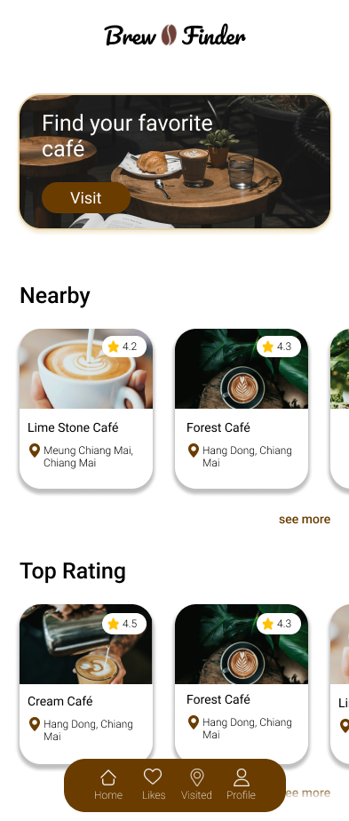

# Café Finder App

  

## Description
The Café Finder App is designed to help users discover top-rated coffee shops near them. Users can easily browse through a curated list of coffee shops, view photos, check reviews, and even explore the café's social media presence on platforms like TikTok or Instagram. Additionally, users can bookmark their favorite cafés and keep track of the ones they've visited.

## Features
- Find top-rated coffee shops nearby
- View café photos and reviews
- Explore café social media presence
- Bookmark favorite cafés
- Keep track of visited cafés
- Share visited cafés on other social media platforms

## How It Benefits Users
The Café Finder App offers several benefits to users:
1. Conveniently find nearby cafés: Users can quickly locate top-rated coffee shops in their vicinity.
2. Make informed decisions: By viewing photos, reviews, and social media content, users can make informed decisions about which café to visit.
3. Personalized experience: Users can bookmark their favorite cafés and keep track of the ones they've visited, creating a personalized list of recommendations.
4. Share experiences: Users can easily share their café visits on other social media platforms, allowing them to showcase their experiences and recommend cafés to friends and followers.

## Why Users Would Use This Application
Users would use the Café Finder App for various reasons:
- When craving coffee or looking for a place to hang out, users can rely on the app to find top-rated cafés nearby.
- The ability to view café photos, reviews, and social media content helps users choose cafés that align with their preferences and interests.
- Bookmarking favorite cafés and keeping track of visited ones offers a convenient way to plan future visits and reminisce about past experiences.
- Sharing café visits on social media allows users to showcase their adventures and recommend cafés to their network.

## Technologies Used
The Café Finder App is built using the following technologies:
- Frontend: Flutter
- APIs: Google Maps API

